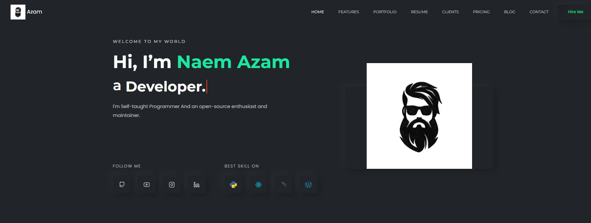

# Neumorphism style Freelancer Portfolio 

It's the latest trend in UI design. The name comes from combining New + Skeuomorphism = Neumorphism and it's a style that relies heavily on using shadows to achieve an almost floating-like effect on the elements in your website or mobile application. Neuromorphic design is also known as soft design.

# Video Demo 

[play Video](https://youtu.be/ULxL9XMfAY0)

# How to Use It?

